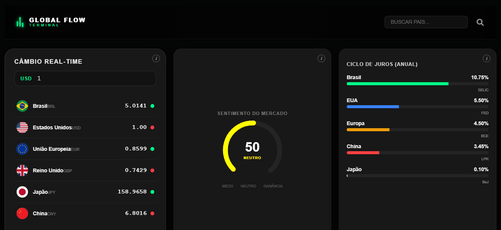

# GLOBAL FLOW TERMINAL
## Dashboard Financeiro e Geopolítico

Uma plataforma integrada para monitorar o mercado financeiro e notícias do mundo todo. O sistema foi desenvolvido com Angular 18+ e usa uma arquitetura moderna baseada em componentes independentes. O projeto se destaca pelas telas que se ajustam sozinhas a qualquer tamanho de monitor ou celular, além de um sistema inteligente que calcula dados e protege o site contra falhas de internet.

---

### DEMONSTRAÇÃO VISUAL

---

### ENGENHARIA DE SOFTWARE E INTERFACE

> O desenvolvimento deste terminal focou na organização do código, no desempenho visual e na velocidade de carregamento da página.

*   **Carregamento Inteligente no Servidor (SSR)**
    O sistema usa configurações especiais nas partes mais pesadas da tela. Isso evita erros visuais na hora que o site está carregando e garante que o usuário não veja o layout "quebrado" enquanto a página abre.

*   **Estilização Segura e Isolada**
    Para organizar as telas, o projeto usa regras de CSS que mudam o tamanho dos componentes de forma certeira. Isso resolve as travas naturais do Angular e faz com que o painel ocupe todo o espaço disponível na tela sem bagunçar o código dos outros elementos.

*   **Layout em Grade Flexível (CSS Grid)**
    O visual do painel de moedas foi desenhado com um sistema de linhas e colunas invisíveis. Ele possui limites de segurança que impedem que as informações e os gráficos fiquem espremidos ou impossíveis de ler.

---

### ARQUITETURA DE DADOS E PROTEÇÃO CONTRA FALHAS

Toda a parte de dados fica em um serviço centralizado. Esse motor foi feito para continuar funcionando mesmo se os servidores de moedas e notícias caírem ou demorarem para responder:

*   **Tentativas Automáticas de Conexão (Política de Retry)**
    Se a internet falhar ou oscilar por um segundo ao buscar as taxas de câmbio, o sistema tenta refazer a busca automaticamente por até duas vezes antes de mostrar uma mensagem de erro na tela.

*   **Travamento por Demora (Timeout & Dados Seguros)**
    Ao buscar as notícias do mercado, o sistema tem um limite de 5 segundos. Se o servidor externo demorar mais do que isso para responder, o site interrompe a busca demorada e injeta dados salvos de forma segura. Isso garante que o painel do usuário nunca fique travado girando o ícone de carregamento.

*   **Plano B para Imagens e Notícias (Fallback)**
    Se as bandeiras dos países ou os canais de notícias ficarem fora do ar, o sistema percebe o erro na hora. Ele substitui a imagem quebrada por um ícone neutro global de forma automática, protegendo o design do site.

*   **Organização de Moedas Sem Travar o Sistema**
    Para conseguir ler centenas de moedas de países diferentes ao mesmo tempo, o código usa uma estrutura flexível no TypeScript. O sistema consegue descobrir qual moeda está chegando e atualizar o valor na hora, sem precisar de uma lista fixa e engessada no código.

---

### ATUALIZAÇÃO DA TELA EM TEMPO REAL

*   **Cálculos Instantâneos com Signals**
    O conversor de moedas calcula os valores em tempo real. Graças às ferramentas modernas do Angular 18, o site atualiza apenas o número exato do resultado na tela, sem precisar recarregar o resto da página. Isso deixa o aplicativo extremamente leve.

*   **Atualização Inteligente de Listas**
    Quando a taxa SELIC ou qualquer outro indicador nacional muda, o sistema atualiza apenas aquela linha específica da tabela. Ele não gasta memória do computador recarregando a lista inteira do zero.

*   **Barras de Progresso Baseadas em Dados**
    O tamanho das barras de progresso muda de forma proporcional ao valor dos juros da economia. O sistema faz uma conta matemática em tempo real e desenha a largura da barra direto na tela de forma fluida.

---

### Site APEX-INVEST

[Clique aqui para acessar o projeto online](https://dash-board-de-cambio-modular-vj2s.vercel.app/)
